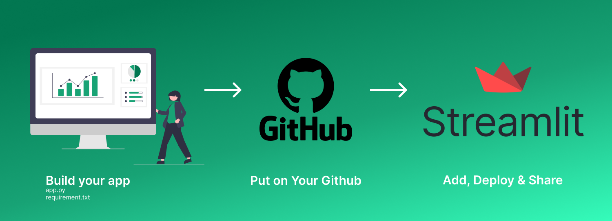

### How to Deploy your Machine Learning Model using Streamlit Sharing

### Steps

1. You have to prepare
   - Github Account: where you will host the app
   - Streamlit: where you deploy your app
   - App + Requirement.txt should be in the Github Repository

2. Package that you have to prepare
   - Pipenv
   - package must be saved under requirement.txt
